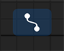

# Introduction to CGProto

CGProto is a node-based scripting editor aims to help developers rapidly prototype or learn computer graphics algorithms. It provides a sandbox that you could easily write javascript and shader languages(metal and glsl currently) and collaborate them together by connecting their inputs and outputs. Read [Quick Start](quick-start.md) to browse all the nodes and their functionality.

To help you fousing on the algorithm itself, CGProto automatically [reflects](io-reflection.md) the parameters and return value of your function to node IO and handle data conversion between them. You don't need to concern about how a javascript Array is fill into a MTLBuffer and then pass to your shader uniforms.

Besides basic data buffer, passing image or mesh between javascript and shaders is also practicable, which means that you can implement some computational geometry algorithms such as procedure mesh generation or curve intepolation in javascript and view the render result instantly. Or, in the contrast, reading pixel data from shaded gpu texture to cpu to do some non-parallelizable image analysis. Read [Data Conversions](data-conversions.md) to discover more about how data pass between javascript and shader

CGProto is applicable of doing 2d and 3d rendering. In both cases, it provides a scalable view to see image output(if exists) of the active node. What is different is that,
when some inputless [3d transform matrix](built-in-shader-variables) is defined in the shader of the active node, you are able to toggle the gesture mode to simlutae an orbit camera control.

javascript library

Sometimes it's annoying to see the dizzy lines when you project get complicated. By tapping the connection visiable button you could hide connection lines except those linked to the active node.

Several sample projects is provided in example tab to help you get involved to CGProto more quickly. We plan to supply more instructive examples in the fureture released of CGProto.

If you hava any questions or suggestions about CGProto, feel free to contact us at [lorentz.0718@gmail.com](mailto:lorentz.0718@gmail.com)

