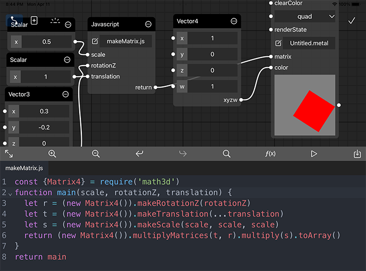

# Data Conversions

## Data Buffer
Scalar, vector, matrix and their array or pointer types defined as uniforms in shader are all treated as data buffer. To fill the buffer content you could not only use the Value nodes(Scalar, VectorN, Timer, ColorPicker), Arthmetic nodes(Addition, Subtraction, Multiplication, Division) and Mix node, but also javascript node. CGProto automatically convert javascript number, array of number or multi-dimension array of number to GPU buffers and pass to shader uniforms. There is no restriction on the dimension of the array because it would be flattened before passed to the GPU. All you need to do is to ensure the data length is sufficient.


## Image
You are able to generate image in javascript and pass to shader texture, or read the pixel data of the render output of a shader node. Here are some examples of valid javascript images. See the table below for more details. 
```javascript
{
  width: 2,
  height: 2,
  pixelFormat: 'rgba8Unorm',
  data: [255, 0, 0, 255, 0, 255, 0, 255, 0, 0, 255, 255, 255, 255, 0, 255]
}

{
  width: 2,
  height: 2,
  depth: 2,
  dimension: 3,
  pixelFormat: 'r16Float',
  data: [0.1, 10.2, 100.3, 1000.4, -50.5, -100, -200, 0]
}

{
  width: 10,
  height: 10,
  dimension: 2,
  pixelFormat: 'rg32Float',
  data: Float32Array.from([...Array(200).keys()])
}
```

|  field | type  | available value | optional |default value
|  ----  | ----  | ---- | ---- | ---- |
| pixelFormat | String | a8Unorm<br><br>r8Unorm\|r8Uint\|r8Snorm\|r8Sint<br>r16Unorm\|r16Uint\|r16Snorm\|r16Sint\|r16Float<br>r32Uint\|r32Sint\|r32Float<br><br>rg8Unorm\|rg8Uint\|rg8Snorm\|rg8Sint<br>rg16Unorm\|rg16Uint\|rg16Snorm\|rg16Sint\|rg16Float<br>rg32Uint\|rg32Sint\|rg32Float<br><br>rgba8Unorm\|rgba8Uint\|rgba8Snorm\|rgba8Sint<br>rgba16Unorm\|rgba16Uint\|rgba16Snorm\|rgba16Sint\|rgba16Float<br>rgba32Uint\|rgba32Sint\|rgba32Float | false |
| dimension  | Integer | 1\|2\|3 | true | 2
| width | Integer | [1, 4096] | false | 
| height | Integer | [1, 4096] | true if dimension < 2 | 1
| depth | Integer | [1, 4096]| true if dimension < 3 | 1
| data | Array of Number\|TypedArray | | false


## Mesh
You are able to generate mesh in javascript and pass to shader mesh input. Here are some examples of valid javascript meshes. See the table below for more details. When indices data is not provided the vertex order makes mesh topology. 

The boundingBox is used for generating world matrix when you are using [built-in shader transforms](built-in-shader-variables?id=transformations). It is an optional value and would be automatically calculated from vertex positions. There are two reason you may provide it explicitly. One is for performance improvement, which is not such important. The other is that if you are making a vertex animation, the center and size of the minimum bounding box may change continually so the object looks jiggling. A constant bounding box could help locking the transform of mesh object.
```javascript
{
  geometryType: 'triangles',
  indices: [0, 1, 2, 1, 3, 2],
  indexBitDepth: 8,
  attributes: [
    {
      name: 'position',
      format: 'float2',
      data: [-1, 1, -1, -1, 1, 1, 1, -1],
    },
    {
      name: 'textureCoordinate',
      format: 'float2',
      data: [0, 0, 0, 1, 1, 0, 1, 1],
    }
  ],
  boundingBox: {
    min: [-1, -1, -1],
    max: [1, 1, 1]
  }
}
```
|  field | type  | available value | optional |default value
|  ----  | ----  | ---- | ---- | ---- |
| geometryType  | String | points<br>lines<br>triangles<br>triangleStrips<br>quads | false | 
| indices  | Uint8Array<br>Uint16Array<br>Uint32Array<br>Array |  | true |
| indexBitDepth | Integer | 8\|16\|32 | true | 32
| attributes | Array of Object |  | false |
| boundingBox | Object | | true | automatically calculated from vertices
| submeshes | Array of Object | | true |


## Mesh Attribute
The attribute name should match the name defined in the corresponed shader.

|  field | type  | available value |
|  ----  | ----  | ---- |
| name | String |
| format | String | uchar\|uchar2\|uchar3\|uchar4<br><br>ucharNorm\|ucharNorm2\|ucharNorm3\|ucharNorm4<br><br>char\|char2\|char3\|char4<br><br>charNorm\|charNorm2\|charNorm3\|charNorm4<br><br>ushort\|ushort2\|ushort3\|ushort4<br><br>ushortNorm\|ushortNorm2\|ushortNorm3\|ushortNorm4<br><br>short\|short2\|short3\|short4<br><br>shortNorm\|shortNorm2\|shortNorm3\|shortNorm4<br><br>uint\|uint2\|uint3\|uint4<br><br>int\|int2\|int3\|int4<br><br>half\|half2\|half3\|half4<br><br>float\|float2\|float3\|float4
| data | Array of Number\|TypedArray | 

## SubMesh
submeshes property was introduced from version 2.4. The properties below are move to submesh. While you are still able to keep the old method to define the mesh structure if there is only one submesh.

- geometryType
- indices
- indexBitDepth

```javascript
{
  submeshes: [
    {
      geometryType: 'triangles',
      indices: [0, 1, 2],
      indexBitDepth: 8,
    },
    {
      geometryType: 'triangles',
      indices: [1, 3, 2],
      indexBitDepth: 8,
    }
  ]
  attributes: [
    {
      name: 'position',
      format: 'float2',
      data: [-1, 1, -1, -1, 1, 1, 1, -1],
    },
    {
      name: 'textureCoordinate',
      format: 'float2',
      data: [0, 0, 0, 1, 1, 0, 1, 1],
    }
  ],
  boundingBox: {
    min: [-1, -1, -1],
    max: [1, 1, 1]
  }
}
```