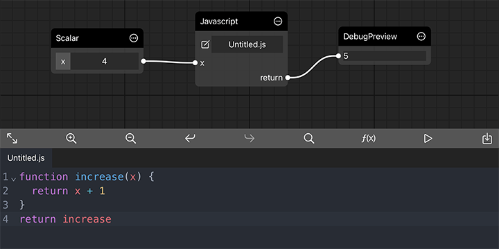
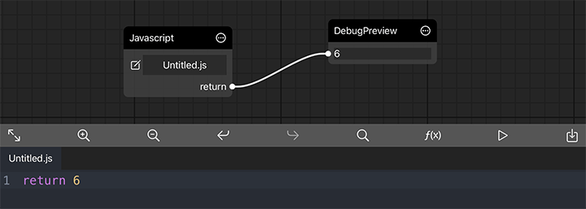

# Javascript

## Declaring Inputs and Outputs
Usually a javascript node expect a function type variable return from your script source. CGProto reflects the parameter of the function to generate the node input. And The value of node output is the return value of your function. Whenever the input of the node have been changed, the node is marked as dirty and the function is re-invoked to produce the new output.


If you just want to generate some constant data. You could simply return the data in you script. When CGProto detect that the type of your returned value is not Function, it simply bypass the value to the node output. 


## Generating Multiple Outputs

Javascript doesn't natively support returning multiple values from function. It use a syntax called destructuring assignment to simulate this functionality. 
```javascript
function f1() {
  return [1, 2]
}
function f2() {
  return {
    c: 3,
    d: 4
  }
}
const [a, b] = f1()
const {c, d} = f2()
```
However, CGProto has not idea how to distinguish whether the returned value should be destructed, since array and object could be treated as single buffer, image or mesh. When you do need to return multiple values in you script, you can pack you values in a object with an additional field called `destructuring` that set to value of true.


## Built-in Library
Javascript library is imported by `require` function. For example, `const math3d = require('math3d')`.
There are two built-in Javascript library in CGProto.

[math3d](https://github.com/cgproto/math3d): this library is modified from the math module of [three.js](https://github.com/mrdoob/three.js/tree/dev/src/math).

[numjs](https://github.com/cgproto/numjs): this library is used for manipulating tensor when using coreml model

You can [import your custom library](README?id=importing-custom-library) but the source should be packed as the form like this

```javascript
(()=>{
  function sub(a, b) {
    return a - b
  }
  return sub
})()
```


## Utility functions
CGProto provides some useful function you could easily insert by clicking the f(x) Button. Currently there are some procedure mesh generation and color space conversion functions provided for javascript.
