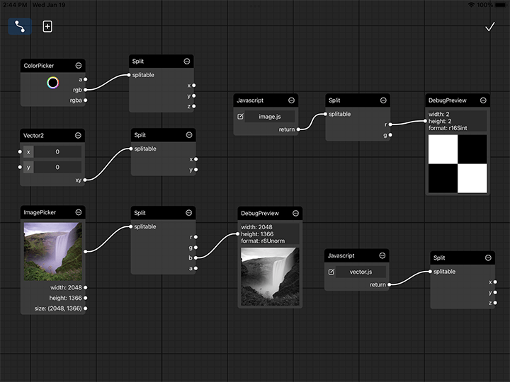

# Non-Scriptable Nodes

## SamplerState
Since immediate sampler state is not support in glsl, you need to define a sampler state node and pass it to the automatically generated sampler input of glsl node. When the sampler input is left empty, CGProto automatically create a default sampler state with linear filter mode and clamp to edge address mode.

## RenderState
Shader node accept a optional render state input. When the input is leave empty, all states are set to default value. See [MTLRenderPipelineColorAttachmentDescriptor](https://developer.apple.com/documentation/metal/mtlrenderpipelinecolorattachmentdescriptor), [MTLDepthStencilDescriptor](https://developer.apple.com/documentation/metal/mtldepthstencildescriptor/) and [MTLRenderCommandEncoder](https://developer.apple.com/documentation/metal/mtlrendercommandencoder/1516029-settrianglefillmode/) for more details. 

|  state | default value
| ---- | ---- |
| wire frame mode | false
| enable blend | false
| rgb blend operation | add
| alpha blend operation | add
| src rgb blend factor | one
| src alpha blend factor | one
| dst rgb blend factor | zero
| dst alpha blend factor | zero
| enable depth write | false
| depth compare function | always

## FaceTrackingAR
You are able to use the TrueDepth API by using the FaceTrackingAR node. It contains several outputs exposing the data of [ARFaceAnchor](https://developer.apple.com/documentation/arkit/arfaceanchor/), [ARFaceGeometry](https://developer.apple.com/documentation/arkit/arfacegeometry) and [ARCamera](https://developer.apple.com/documentation/arkit/arcamera/). 

- The most recent still frame captured by the active camera feed, with additional size info.
- [faceGeometry](https://developer.apple.com/documentation/arkit/arfacegeometry): A coarse triangle mesh representing the topology of the detected face.
- [blendShapes](https://developer.apple.com/documentation/arkit/arfaceanchor/2928251-blendshapes): A dictionary of named coefficients representing the detected facial expression in terms of the movement of specific facial features.
- [faceTransform](https://developer.apple.com/documentation/arkit/aranchor/2867981-transform): The face’s current position and orientation in world coordinates.
- [viewMatrix](https://developer.apple.com/documentation/arkit/arcamera/2921672-viewmatrix): A transform matrix for converting from world space to camera space.
- [projectionMatrix](https://developer.apple.com/documentation/arkit/arcamera/2887458-projectionmatrix): A transform matrix appropriate for rendering 3D content to match the image captured by the camera.

Since using ARKit may drain the battery of your device very fast. CGProto also provide a switch button for you to pause the camera. 

## Scalar and Vector

## Timer
## ColorPicker
## Arithmetic and Mix
Arithmetic and Mix nodes take Vector or Scalar as input and return the calculated value. When both inputs are Vector, their dimension must be equal. When one is Vector and the other is Scalar, the scalar would to implicitly converted to vector with all components set to the same value. 

## ImagePicker
## Text
## Split
Split node accpet vector or image as input. The vector could be a javascript array of numbers if array.length is between [2, 4]. When the input of a split node is image, it return multiple single channel pixel format texture according to the pixel format of the input texture. For example, a rg16Sint texture would be split into 2 r16Sint textures.

## DebugPreview

