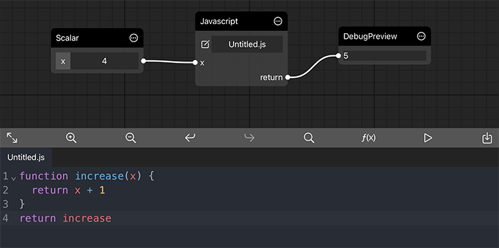
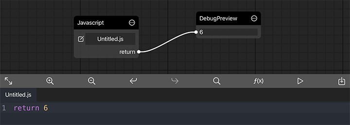
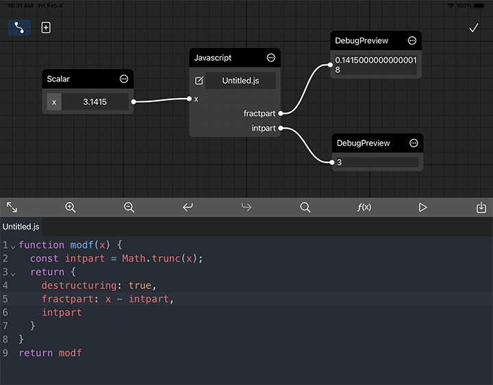
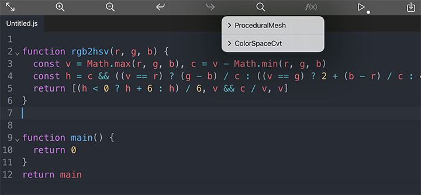
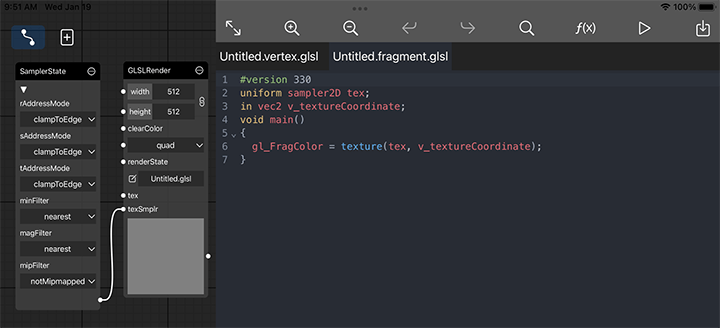
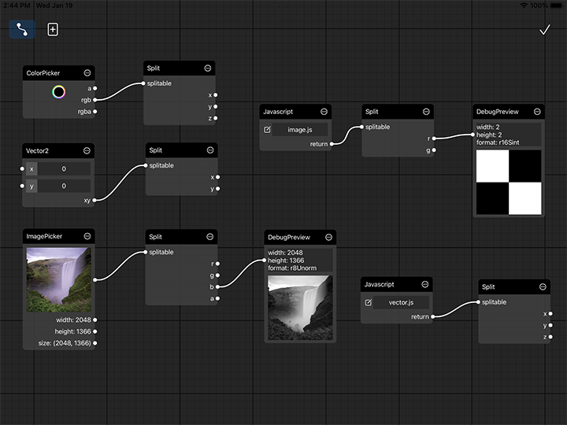

# Quick Start

## Javascript

Usually a javascript node expect a function type variable return from your scriot source. CGProto reflects the parameter of the function to generate the node input. And The value of node output is the return value of your function. Whenever the input of the node have been changed, the node is marked as dirty and the function is re-invoked to produce the new output.


If you just want to generate some constant data. You could simply return the data in you script. When CGProto detect that the type of your returned value is not Function, it simply bypass the value to the node output. 


Javascript doesn't natively support returning multiple values from function. It use a syntax called destructuring assignment to simulate this functionality. 
```javascript
function f1() {
  return [1, 2]
}
function f2() {
  return {
    c: 3,
    d: 4
  }
}
const [a, b] = f1()
const {c, d} = f2()
```
However, CGProto has not idea how to distinguish whether the returned value should be destructed, since array and object could be treated as single buffer, image or mesh. When you do need to return multiple values in you script, you can pack you values in a object with an additional field called `destructuring` that set to value of true.


CGProto provides some useful function you could easily insert by clicking the f(x) Button. Currently there are only some procedure mesh generation functions for javascript node.


## Meta/GLSL/HLSLRender
A single draw pass with configurable render size, clear color, geometry mesh, render state and vertex and fragment shaders. The default value of clear color is [0.5, 0.5, 0.5, 1.0]. 

## ShaderLab

## SamplerState
Since immediate sampler state is not support in glsl, you need to define a sampler state node and pass it to the automatically generated sampler input of glsl node. When the sampler input is left empty, CGProto automatically create a default sampler state with linear filter mode and repeat address mode.


## RenderState
Each render pass accept a optional render state input. When the input is leave empty, all states are set to default value. See for [MTLRenderPipelineColorAttachmentDescriptor](https://developer.apple.com/documentation/metal/mtlrenderpipelinecolorattachmentdescriptor), [MTLDepthStencilDescriptor](https://developer.apple.com/documentation/metal/mtldepthstencildescriptor/) and [MTLRenderCommandEncoder](https://developer.apple.com/documentation/metal/mtlrendercommandencoder/1516029-settrianglefillmode/) for more details. 

|  state | default value
| ---- | ---- |
| wire frame mode | false
| enable blend | false
| rgb blend operation | add
| alpha blend operation | add
| src rgb blend factor | one
| src alpha blend factor | one
| dst rgb blend factor | zero
| dst alpha blend factor | zero
| enable depth write | false
| depth compare function | always

## Scalar and Vector

## Timer
## ColorPicker
## Arithmetic and Mix
Arithmetic and Mix nodes take Vector or Scalar as input and return the calculated value. When both inputs are Vector, their dimension must be equal. When one is Vector and the other is Scalar, the scalar would to implicitly converted to vector with all components set to the value. 
## ImagePicker
## Text
## Split
Split node accpet vector or image as input. The vector could be a javascript array of numbers if array.length is between [2, 4]. When the input of a split node is image, it return multiple single channel pixel format texture according to the pixel format of the input texture. For example, a rg16Sint texture would be split into 2 r16Sint textures.

## DebugPreview

