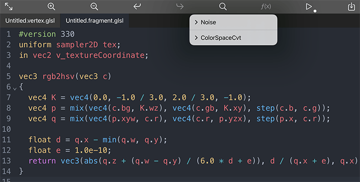

## Shader Nodes

## Declaring Inputs
The inputs of shader node are automatically reflected from uniform parameters of GLSL, HLSL or Metal, or from [material properties](https://docs.unity3d.com/Manual/SL-Properties.html) when writting Unity ShaderLab.

## Using Built-in Variables
CGProto defines some commonly used [shader variables](built-in-shader-variables.md). When you declare these variables in your shader, they would not be reflected to node inputs and their values are automatically setted. It's your responsibility to guarantee the data type of variables match the specification.

## The ClearColor Input
From version over 1.8, the clearColor not only accepting vector4 as input but also image. When your shader contains the built-in variable REFLECTION_MAP (unity_SpecCube0 instead when you are writting ShaderLab), the input image is treated as a cubemap atlas and would be render to the background as a skybox. Or else CGProto simply stretch the image to fill the background.

## Utility Functions
CGProto provides some useful function you could easily insert by clicking the f(x) Button. Currently there are some noise generation and color space conversion functions provided for shader.
