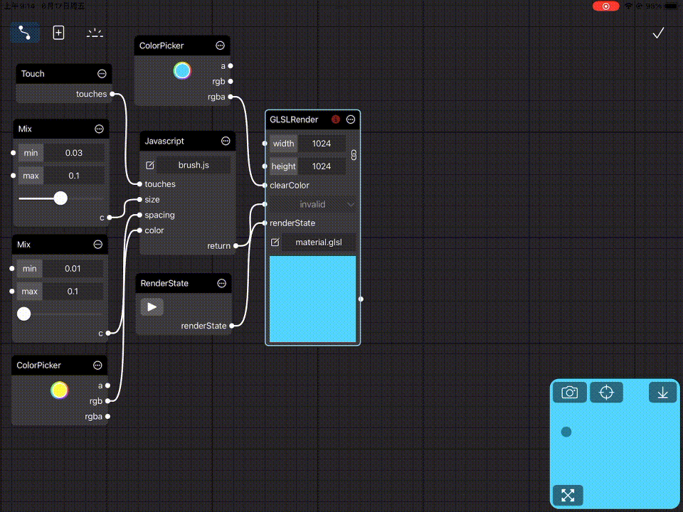

# Touch API

From version over 2.2, you are able to receive touch events over the preview window by creating a Touch node. Before you start interacting with the screen, you should switch the preview mode button to 'Touch Event'



The return value of Touch node is an array of objects that contains location and phase of touch. It's consumable which means that when there is no touch event, this value turn into an empty array. 

The location of touch object is a normalized coordinate in preview window. The upper left corner of preview window corresponds to (0, 0) and the lower right corner corresponds to (1, 1). 

The phase is a string type variable with 4 possible values.

- began: A touch for a given event has pressed down on the screen.
- moved: A touch for a given event has moved over the screen.
- ended: A touch for a given event has lifted from the screen.
- cancelled: The system canceled tracking for a touch, for example, when the user moves the device against their face.

```javascript
[
  {
    location: {
      x: 0,
      y: 0,
    },
    phase: 'began'
  },
  {
    location: {
      x: 1,
      y: 0
    },
    phase: 'moved'
  },
  {
    location: {
      x: 1,
      y: 1
    },
    phase: 'ended'
  }
]
```